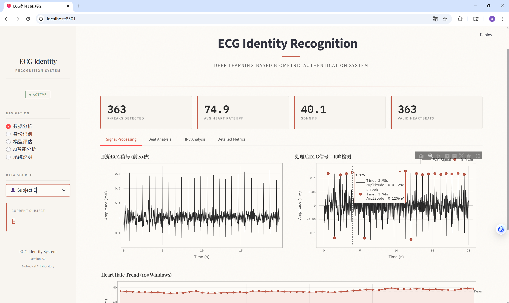
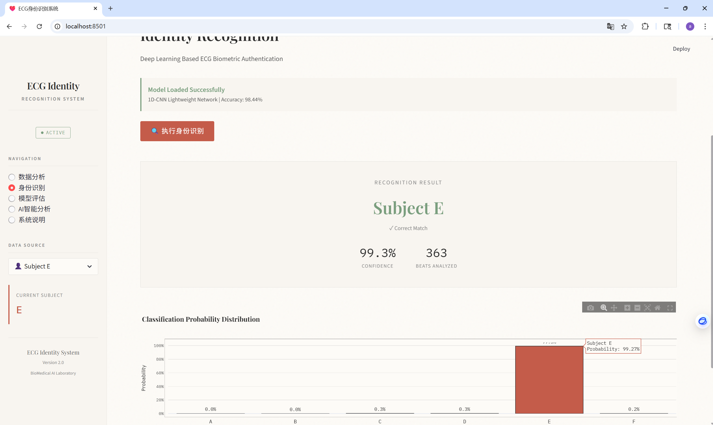
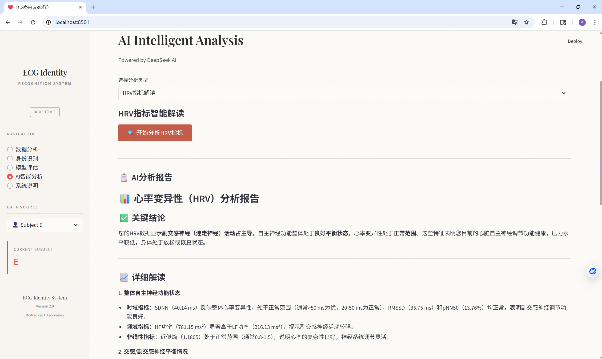
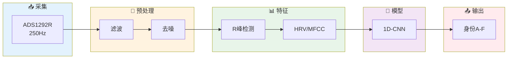
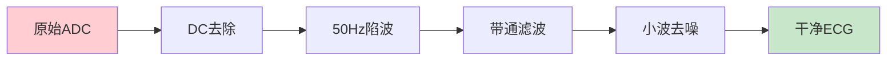
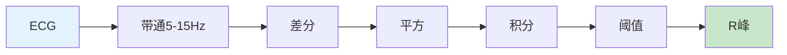

<!-- Header Wave Banner -->


<div align="center">

<!-- Typing Animation Title -->
<a href="https://github.com/Marways7/ECG_IdentificationX">
  
</a>

<br/><br/>

<!-- Badges Row 1: Social -->
<p>
<a href="https://github.com/Marways7/ECG_IdentificationX/stargazers"></a>
<a href="https://github.com/Marways7/ECG_IdentificationX/network/members"></a>
<a href="https://github.com/Marways7/ECG_IdentificationX/issues"></a>
</p>

<!-- Badges Row 2: Tech -->
<p>


</p>

<!-- Badges Row 3: Stats -->
<p>


</p>

<br/>

[🚀 快速开始](#-快速开始) · [📊 性能](#-性能指标) · [🔬 算法](#-核心算法) · [📖 文档](#-文档)

---

**🌍 语言**: [🇨🇳 中文](#-项目背景) | [🇬🇧 English](#-english)

</div>

<br/>

<!-- Performance Cards -->
<div align="center">

<table>
<tr>
<td align="center" width="25%">

<br/><b>98.44%</b>
<br/><sub>测试准确率</sub>
</td>
<td align="center" width="25%">

<br/><b>98.44%</b>
<br/><sub>F1分数</sub>
</td>
<td align="center" width="25%">

<br/><b>~44K</b>
<br/><sub>模型参数</sub>
</td>
<td align="center" width="25%">

<br/><b><10ms</b>
<br/><sub>推理时间</sub>
</td>
</tr>
</table>

</div>

---

## 📚 项目背景

### 🎓 课程项目

本项目是**生产实习课程**的实践作品，旨在探索基于心电信号(ECG)的生物特征身份识别技术。

### 💡 研究动机

心电图(ECG)作为一种新兴的生物特征识别手段，相比传统方法具有独特优势：

| 特性 | 优势说明 |
|:---:|:---|
| 🔐 **活体检测** | ECG信号只能从活体获取，天然具备防伪能力 |
| 🧬 **唯一性** | 每个人的心脏电生理特征具有独特性 |
| 🛡️ **难以伪造** | 相比指纹、面部等特征，ECG极难被复制 |
| ⏱️ **持续验证** | 可实现持续的身份监测与验证 |

### 📋 项目概述

- **数据采集**: 使用ADS1292R心电采集装置收集6位同学的心电数据
- **采样规格**: 250Hz采样率，24位ADC精度，每人约5分钟数据
- **核心技术**: 信号预处理 + Pan-Tompkins R峰检测 + 1D-CNN深度学习分类
- **最终成果**: 测试准确率达到 **98.44%**，满足实际应用需求

---

## ✨ 项目亮点

<table>
<tr>
<td width="50%">

### 🎯 高精度识别

| 指标 | 数值 |
|:---|:---:|
| 测试准确率 | **98.44%** |
| F1分数 | **98.44%** |
| 特异性 | **99.68%** |
| 误判数 | **8/512** |

</td>
<td width="50%">

### ⚡ 轻量高效

| 特性 | 数值 |
|:---|:---:|
| 模型参数 | **~44,000** |
| 推理时间 | **<10ms** |
| 模型体积 | **<1MB** |
| 实时验证 | **✅** |

</td>
</tr>
<tr>
<td width="50%">

### 🔬 专业算法

- 📈 **Pan-Tompkins** R峰检测
- 🌊 **db6小波** 自适应去噪
- ❤️ **HRV分析** 时/频/非线性
- 🎵 **MFCC** 频域特征提取

</td>
<td width="50%">

### 🤖 AI智能分析

- 🧠 **DeepSeek AI** 辅助诊断
- 📝 **智能报告** 自动生成
- 📊 **交互式** 可视化界面
- 🎨 **学术风格** 专业UI

</td>
</tr>
</table>

---

## 🖼️ 页面展示

<div align="center">

### 📊 数据分析

<br/><sub>信号预处理、R峰检测、心拍分割可视化</sub>

<br/><br/>

### 🎯 身份识别

<br/><sub>实时身份识别与置信度展示</sub>

<br/><br/>

### 📈 模型评估

<br/><sub>混淆矩阵、准确率、F1分数等评估指标</sub>

<br/><br/>

### 🤖 AI智能分析

<br/><sub>DeepSeek AI辅助生成分析报告</sub>

</div>

---

## �📊 性能指标

<div align="center">

| 🎯 指标 | 📈 数值 | 🎯 指标 | 📈 数值 |
|:---:|:---:|:---:|:---:|
| **测试准确率** | 98.44% | **验证准确率** | 99.22% |
| **精确率** | 98.45% | **敏感度/召回率** | 98.44% |
| **F1分数** | 98.44% | **特异性** | 99.68% |

</div>

### 📋 混淆矩阵

<div align="center">

|  | **A** | **B** | **C** | **D** | **E** | **F** | **Recall** |
|:---:|:---:|:---:|:---:|:---:|:---:|:---:|:---:|
| **A** | 72 | 0 | 1 | 0 | 0 | 0 | 98.6% |
| **B** | 0 | 104 | 0 | 0 | 0 | 1 | 99.0% |
| **C** | 2 | 0 | 103 | 0 | 0 | 0 | 98.1% |
| **D** | 0 | 0 | 1 | 78 | 0 | 1 | 97.5% |
| **E** | 0 | 0 | 1 | 0 | 72 | 0 | 98.6% |
| **F** | 0 | 1 | 0 | 0 | 0 | 75 | 98.7% |

<sub>总测试样本: 512 | 正确分类: 504 | 错误分类: 8</sub>

</div>

---

## 🚀 快速开始

### 📋 环境要求

<table>
<tr>
<td>

| 依赖 | 版本 |
|:---|:---:|
| Python | 3.10+ |
| PyTorch | 2.0+ |
| CUDA | 11.8+ (可选) |

</td>
<td>

| 必需配置 | 说明 |
|:---|:---|
| DeepSeek API | AI分析功能 |
| `.env` 文件 | 存储API密钥 |

</td>
</tr>
</table>

### 📥 安装步骤

```bash
# 1️⃣ 克隆仓库
git clone https://github.com/Marways7/ECG_IdentificationX.git
cd ECG_IdentificationX

# 2️⃣ 安装依赖
pip install -r requirements.txt

# 3️⃣ 配置API密钥
echo "DEEPSEEK_API_KEY=your_api_key_here" > .env
echo "DEEPSEEK_BASE_URL=https://api.deepseek.com/v1" >> .env

# 4️⃣ 准备ECG数据 (见下方说明)
# 将你的ECG数据文件放入 ECG_data/ 目录

# 5️⃣ 训练模型
python train.py --epochs 50 --model_type lightweight

# 6️⃣ 启动Web界面
streamlit run app.py
```

<details>
<summary>📁 <b>如何准备ECG数据？</b></summary>

> ⚠️ **隐私说明**: 由于心电数据属于个人生物特征数据，涉及隐私，本仓库不包含原始数据。

请将你的ECG数据文件放入 `ECG_data/` 目录，数据格式要求：

| 字段 | 说明 |
|:---|:---|
| `timestamp` | 时间戳 |
| `Channel 1` | ECG信号 (24-bit ADC原始值) |
| `Channel 2` | 呼吸信号 (可选) |

**示例文件结构**:
```
ECG_data/
├── A.csv    # 受试者A的数据
├── B.csv    # 受试者B的数据
└── ...      # 更多受试者
```

**CSV文件格式**:
```csv
timestamp,Channel 1,Channel 2,Channel 3
1767759832,128363,11421861,652
1767759832,128774,11421871,652
...
```

</details>

<details>
<summary>📌 <b>如何获取 DeepSeek API Key？</b></summary>

1. 访问 [DeepSeek Platform](https://platform.deepseek.com/)
2. 注册/登录账号
3. 创建 API Key
4. 复制到 `.env` 文件

</details>

> 🌐 启动后访问 **http://localhost:8501**

---

## 🏗️ 系统架构



### 📁 项目结构

```
📦 ECG_IdentificationX
 ┣ 📂 ECG_data/          # 原始数据 (A-F, 共2558心拍)
 ┣ 📂 src/
 ┃ ┣ 📂 preprocessing/   # 信号预处理
 ┃ ┣ 📂 feature_extraction/  # 特征提取
 ┃ ┣ 📂 models/          # 深度学习模型
 ┃ ┗ 📂 utils/           # 工具函数
 ┣ 📂 docs/              # 技术文档
 ┣ 📄 app.py             # Web界面
 ┣ 📄 train.py           # 训练脚本
 ┗ 📄 .env               # API配置
```

---

## 🔬 核心算法

### 信号预处理



### Pan-Tompkins R峰检测



### HRV分析体系

| ⏱️ 时域 | 📊 频域 | 🔀 非线性 |
|:---:|:---:|:---:|
| SDNN | VLF | SD1/SD2 |
| RMSSD | LF | ApEn |
| pNN50 | HF | SampEn |
| pNN20 | LF/HF | DFA |

### LightweightCNN

```
输入[175] → Conv(32,k7) → Conv(64,k5) → Conv(128,k3) → GAP → FC(64) → 输出[6]
```

---

## 📦 数据规格

<div align="center">

| 参数 | 值 | 参数 | 值 |
|:---:|:---:|:---:|:---:|
| 芯片 | ADS1292R | 采样率 | 250Hz |
| ADC | 24-bit | 增益 | 6x |
| 参考电压 | 2.42V | 总心拍数 | 2,558 |

**ADC转换公式**: $V_{mV} = \frac{(ADC - \overline{ADC}) \times 2 \times 2.42 \times 1000}{6 \times 2^{24}}$

</div>

---

## 🛠️ 技术栈

<div align="center">


| 类别 | 技术 |
|:---:|:---|
| 🐍 语言 | Python 3.10+ |
| 🧠 深度学习 | PyTorch 2.0+ |
| 📊 信号处理 | SciPy, NumPy, PyWavelets |
| 🤖 AI | DeepSeek API |
| 🌐 Web | Streamlit, Plotly |

</div>

---

## 📖 文档

| 📄 文档 | 📝 内容 |
|:---|:---|
| [📘 系统概述](docs/Technical_Documentation_Part1_Overview.md) | 架构、数据规格 |
| [📗 信号预处理](docs/Technical_Documentation_Part2_Preprocessing.md) | 滤波、去噪 |
| [📙 R峰检测](docs/Technical_Documentation_Part3_R_Peak_Detection.md) | Pan-Tompkins |
| [📕 特征提取](docs/Technical_Documentation_Part4_HRV_Features.md) | HRV、MFCC |
| [📓 深度学习](docs/Technical_Documentation_Part5_Deep_Learning_Models.md) | CNN模型 |
| [📔 训练评估](docs/Technical_Documentation_Part6_Training.md) | 训练策略 |
| [📒 性能总结](docs/Technical_Documentation_Part7_Performance_Summary.md) | 结果分析 |

---

## 🇬🇧 English

<details>
<summary><b>📖 Click to expand English documentation</b></summary>

<br/>

### ✨ Highlights

| Feature | Description |
|:---|:---|
| 🎯 **High Accuracy** | 98.44% test accuracy, 98.44% F1 score |
| ⚡ **Lightweight** | Only ~44K parameters, <10ms inference |
| 🔬 **Professional** | Pan-Tompkins + Wavelet + HRV + MFCC |
| 🤖 **AI-Powered** | DeepSeek AI intelligent analysis |

### 🚀 Quick Start

```bash
git clone https://github.com/Marways7/ECG_IdentificationX.git
cd ECG_IdentificationX
pip install -r requirements.txt
echo "DEEPSEEK_API_KEY=your_key" > .env
python train.py
streamlit run app.py
```

### 📊 Performance

| Metric | Value | Metric | Value |
|:---:|:---:|:---:|:---:|
| Test Accuracy | 98.44% | Precision | 98.45% |
| F1 Score | 98.44% | Recall | 98.44% |

</details>

---

## 📄 License

<div align="center">

[](LICENSE)

This project is licensed under the **MIT License**

</div>

---

## Star History

[](https://www.star-history.com/#Marways7/ECG_IdentificationX&type=date&legend=top-left)

---

<div align="center">

### ⭐ 如果这个项目对你有帮助，请点个 Star！

<a href="https://github.com/Marways7/ECG_IdentificationX/stargazers">

</a>

<br/><br/>

**Made with ❤️ for ECG Biometric Research**

<sub>© 2026 ECG-ID Project | <a href="https://github.com/Marways7">@Marways7</a></sub>

</div>

<!-- Footer Banner -->

