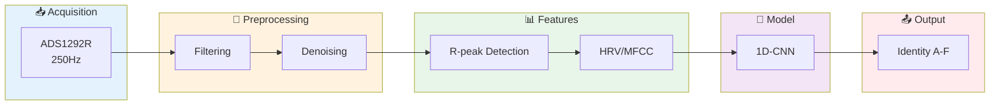
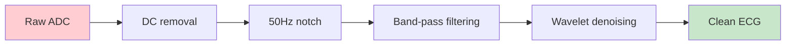
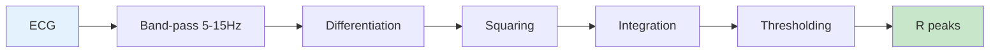

<!-- Header Wave Banner -->


<div align="center">

<!-- Typing Animation Title -->
<a href="https://github.com/Marways7/ECG_IdentificationX">
  
</a>

<br/><br/>

<!-- Badges Row 1: Social -->
<p>
<a href="https://github.com/Marways7/ECG_IdentificationX/stargazers"></a>
<a href="https://github.com/Marways7/ECG_IdentificationX/network/members"></a>
<a href="https://github.com/Marways7/ECG_IdentificationX/issues"></a>
</p>

<!-- Badges Row 2: Tech -->
<p>


</p>

<!-- Badges Row 3: Stats -->
<p>


</p>

<br/>

[🚀 Quick Start](#-quick-start) · [📊 Performance](#-performance-metrics) · [🔬 Algorithms](#-core-algorithms) · [📖 Docs](#-documentation)

---

**🌍 Language**: [English](README.md) | [简体中文](README.zh-CN.md) | [繁體中文](README.zh-Hant.md)

</div>

<br/>

<!-- Performance Cards -->
<div align="center">

<table>
<tr>
<td align="center" width="25%">

<br/><b>98.44%</b>
<br/><sub>Test Accuracy</sub>
</td>
<td align="center" width="25%">

<br/><b>98.44%</b>
<br/><sub>F1 Score</sub>
</td>
<td align="center" width="25%">

<br/><b>~44K</b>
<br/><sub>Parameters</sub>
</td>
<td align="center" width="25%">

<br/><b><10ms</b>
<br/><sub>Inference Time</sub>
</td>
</tr>
</table>

</div>

---

## 📚 Project Background

### 🎓 Course Project

This project is a practical deliverable for the **Production Internship Course**, aiming to explore ECG-signal-based biometric identification technology.

### 💡 Motivation

As an emerging biometric modality, ECG offers unique advantages over traditional methods:

| Feature | Advantage |
|:---:|:---|
| 🔐 **Liveness Detection** | ECG signals can only be captured from living subjects, naturally providing anti-spoofing capability. |
| 🧬 **Uniqueness** | Each person has unique cardiac electrophysiological characteristics. |
| 🛡️ **Hard to Forge** | Compared with fingerprints or faces, ECG is extremely difficult to replicate. |
| ⏱️ **Continuous Verification** | Supports continuous identity monitoring and verification. |

### 📋 Project Overview

- **Data Collection**: Collected ECG data from 6 subjects using an ADS1292R acquisition device.
- **Sampling Specs**: 250Hz sampling rate, 24-bit ADC precision, ~5 minutes of data per person.
- **Core Technologies**: Signal preprocessing + Pan-Tompkins R-peak detection + 1D-CNN deep learning classification.
- **Final Result**: Test accuracy reached **98.44%**, meeting practical application requirements.

---

## ✨ Highlights

<table>
<tr>
<td width="50%">

### 🎯 High-Accuracy Identification

| Metric | Value |
|:---|:---:|
| Test Accuracy | **98.44%** |
| F1 Score | **98.44%** |
| Specificity | **99.68%** |
| Misclassifications | **8/512** |

</td>
<td width="50%">

### ⚡ Lightweight & Efficient

| Feature | Value |
|:---|:---:|
| Parameters | **~44,000** |
| Inference Time | **<10ms** |
| Model Size | **<1MB** |
| Real-time Verification | **✅** |

</td>
</tr>
<tr>
<td width="50%">

### 🔬 Professional Algorithms

- 📈 **Pan-Tompkins** R-peak Detection
- 🌊 **db6 wavelet** adaptive denoising
- ❤️ **HRV analysis** (time-domain / frequency-domain / nonlinear)
- 🎵 **MFCC** frequency-domain feature extraction

</td>
<td width="50%">

### 🤖 AI-Powered Analysis

- 🧠 **DeepSeek AI** for assisted analysis
- 📝 **Smart reports** with automatic generation
- 📊 **Interactive** visualization interface
- 🎨 **Academic-style** professional UI

</td>
</tr>
</table>

---

## 🖼️ Interface Preview

<div align="center">

### 📊 Data Analysis

<br/><sub>Visualization of signal preprocessing, R-peak detection, and heartbeat segmentation</sub>

<br/><br/>

### 🎯 Identity Recognition

<br/><sub>Real-time identity recognition with confidence display</sub>

<br/><br/>

### 📈 Model Evaluation

<br/><sub>Confusion matrix, accuracy, F1 score, and other evaluation metrics</sub>

<br/><br/>

### 🤖 AI-Powered Analysis

<br/><sub>DeepSeek AI-assisted report generation</sub>

</div>

---

## 📊 Performance Metrics

<div align="center">

| 🎯 Metric | 📈 Value | 🎯 Metric | 📈 Value |
|:---:|:---:|:---:|:---:|
| **Test Accuracy** | 98.44% | **Validation Accuracy** | 99.22% |
| **Precision** | 98.45% | **Sensitivity/Recall** | 98.44% |
| **F1 Score** | 98.44% | **Specificity** | 99.68% |

</div>

### 📋 Confusion Matrix

<div align="center">

|  | **A** | **B** | **C** | **D** | **E** | **F** | **Recall** |
|:---:|:---:|:---:|:---:|:---:|:---:|:---:|:---:|
| **A** | 72 | 0 | 1 | 0 | 0 | 0 | 98.6% |
| **B** | 0 | 104 | 0 | 0 | 0 | 1 | 99.0% |
| **C** | 2 | 0 | 103 | 0 | 0 | 0 | 98.1% |
| **D** | 0 | 0 | 1 | 78 | 0 | 1 | 97.5% |
| **E** | 0 | 0 | 1 | 0 | 72 | 0 | 98.6% |
| **F** | 0 | 1 | 0 | 0 | 0 | 75 | 98.7% |

<sub>Total test samples: 512 | Correct classifications: 504 | Misclassifications: 8</sub>

</div>

---

## 🚀 Quick Start

### 📋 Requirements

<table>
<tr>
<td>

| Dependency | Version |
|:---|:---:|
| Python | 3.10+ |
| PyTorch | 2.0+ |
| CUDA | 11.8+ (optional) |

</td>
<td>

| Required Setup | Description |
|:---|:---|
| DeepSeek API | AI analysis feature |
| `.env` file | Store API keys |

</td>
</tr>
</table>

### 📥 Installation Steps

```bash
# 1️⃣ Clone repository
git clone https://github.com/Marways7/ECG_IdentificationX.git
cd ECG_IdentificationX

# 2️⃣ Install dependencies
pip install -r requirements.txt

# 3️⃣ Configure API key
echo "DEEPSEEK_API_KEY=your_api_key_here" > .env
echo "DEEPSEEK_BASE_URL=https://api.deepseek.com/v1" >> .env

# 4️⃣ Prepare ECG data (see details below)
# Put your ECG files into `ECG_data/`

# 5️⃣ Train model
python train.py --epochs 50 --model_type lightweight

# 6️⃣ Launch web interface
streamlit run app.py
```

<details>
<summary>📁 <b>How to prepare ECG data?</b></summary>

> ⚠️ **Privacy Notice**: ECG data is personally identifiable biometric data. To protect privacy, this repository does not include raw ECG recordings.

Place your ECG files in `ECG_data/` with the following format:

| Field | Description |
|:---|:---|
| `timestamp` | Timestamp |
| `Channel 1` | ECG signal (24-bit ADC raw value) |
| `Channel 2` | Respiration signal (optional) |

**Example file structure**:
```
ECG_data/
├── A.csv    # Data for subject A
├── B.csv    # Data for subject B
└── ...      # More subjects
```

**CSV file format**:
```csv
timestamp,Channel 1,Channel 2,Channel 3
1767759832,128363,11421861,652
1767759832,128774,11421871,652
...
```

</details>

<details>
<summary>📌 <b>How to get a DeepSeek API Key?</b></summary>

1. Visit [DeepSeek Platform](https://platform.deepseek.com/)
2. Sign up / log in
3. Create an API key
4. Copy it into `.env`

</details>

> 🌐 After startup, visit **http://localhost:8501**

---

## 🏗️ System Architecture


```mermaid
flowchart LR
    subgraph A[" 📥 Acquisition "]
        A1["ADS1292R<br/>250Hz"]
    end
    
    subgraph B[" 🔧 Preprocessing "]
        B1["Filtering"] --> B2["Denoising"]
    end
    
    subgraph C[" 📊 Features "]
        C1["R-peak Detection"]
        C2["HRV/MFCC"]
    end
    
    subgraph D[" 🧠 Model "]
        D1["1D-CNN"]
    end
    
    subgraph E[" 📤 Output "]
        E1["Identity A-F"]
    end
    
    A1 --> B1
    B2 --> C1
    C1 --> C2
    C2 --> D1
    D1 --> E1
    
    style A fill:#e3f2fd
    style B fill:#fff3e0
    style C fill:#e8f5e9
    style D fill:#f3e5f5
    style E fill:#ffebee
```

### 📁 Project Structure

```
📦 ECG_IdentificationX
 ┣ 📂 ECG_data/          # Raw data (A-F, total 2558 beats)
 ┣ 📂 src/
 ┃ ┣ 📂 preprocessing/   # Signal preprocessing
 ┃ ┣ 📂 feature_extraction/  # Feature extraction
 ┃ ┣ 📂 models/          # Deep learning models
 ┃ ┗ 📂 utils/           # Utility functions
 ┣ 📂 docs/              # Technical docs
 ┣ 📄 app.py             # Web interface
 ┣ 📄 train.py           # Training script
 ┗ 📄 .env               # API config
```

---

## 🔬 Core Algorithms

### Signal Preprocessing


```mermaid
flowchart LR
    A["Raw ADC"] --> B["DC removal"] --> C["50Hz notch"] --> D["Band-pass filtering"] --> E["Wavelet denoising"] --> F["Clean ECG"]
    style A fill:#ffcdd2
    style F fill:#c8e6c9
```

### Pan-Tompkins R-peak Detection


```mermaid
flowchart LR
    A["ECG"] --> B["Band-pass 5-15Hz"] --> C["Differentiation"] --> D["Squaring"] --> E["Integration"] --> F["Thresholding"] --> G["R peaks"]
    style A fill:#e3f2fd
    style G fill:#c8e6c9
```

### HRV Analysis System

| ⏱️ Time Domain | 📊 Frequency Domain | 🔀 Nonlinear |
|:---:|:---:|:---:|
| SDNN | VLF | SD1/SD2 |
| RMSSD | LF | ApEn |
| pNN50 | HF | SampEn |
| pNN20 | LF/HF | DFA |

### LightweightCNN

```
Input[175] → Conv(32,k7) → Conv(64,k5) → Conv(128,k3) → GAP → FC(64) → Output[6]
```

---

## 📦 Data Specifications

<div align="center">

| Parameter | Value | Parameter | Value |
|:---:|:---:|:---:|:---:|
| Chip | ADS1292R | Sampling rate | 250Hz |
| ADC | 24-bit | Gain | 6x |
| Reference voltage | 2.42V | Total beats | 2,558 |

**ADC conversion formula**: $V_{mV} = \frac{(ADC - \overline{ADC}) \times 2 \times 2.42 \times 1000}{6 \times 2^{24}}$

</div>

---

## 🛠️ Tech Stack

<div align="center">


| Category | Technology |
|:---:|:---|
| 🐍 Language | Python 3.10+ |
| 🧠 Deep Learning | PyTorch 2.0+ |
| 📊 Signal Processing | SciPy, NumPy, PyWavelets |
| 🤖 AI | DeepSeek API |
| 🌐 Web | Streamlit, Plotly |

</div>

---

## 📖 Documentation

| 📄 Document | 📝 Content |
|:---|:---|
| [📘 System Overview](docs/Technical_Documentation_Part1_Overview.md) | Architecture, data specs |
| [📗 Signal Preprocessing](docs/Technical_Documentation_Part2_Preprocessing.md) | Filtering, denoising |
| [📙 R-peak Detection](docs/Technical_Documentation_Part3_R_Peak_Detection.md) | Pan-Tompkins |
| [📕 Feature Extraction](docs/Technical_Documentation_Part4_HRV_Features.md) | HRV, MFCC |
| [📓 Deep Learning](docs/Technical_Documentation_Part5_Deep_Learning_Models.md) | CNN architecture |
| [📔 Training & Evaluation](docs/Technical_Documentation_Part6_Training.md) | Training strategy |
| [📒 Performance Summary](docs/Technical_Documentation_Part7_Performance_Summary.md) | Result analysis |

---

## 📄 License

<div align="center">

[](LICENSE)

This project is licensed under the **MIT License**

</div>

---

## Star History

[](https://www.star-history.com/#Marways7/ECG_IdentificationX&type=date&legend=top-left)

---

<div align="center">

### ⭐ If this project helps you, please give it a Star!

<a href="https://github.com/Marways7/ECG_IdentificationX/stargazers">

</a>

<br/><br/>

**Made with ❤️ for ECG Biometric Research**

<sub>© 2026 ECG-ID Project | <a href="https://github.com/Marways7">@Marways7</a></sub>

</div>

<!-- Footer Banner -->

