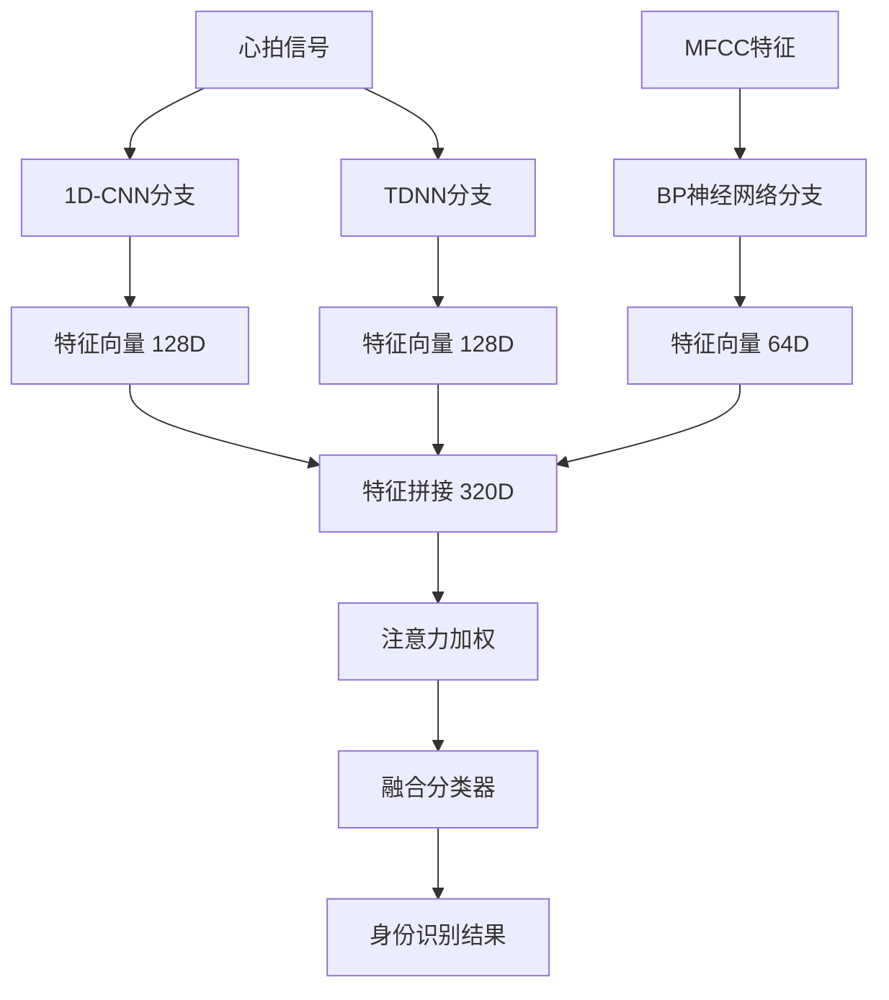

# 第五部分：深度学习模型架构

## 5.1 模型设计概述

### 5.1.1 设计目标

设计一个能够有效处理ECG心拍信号的身份识别模型，需满足：

1. **高准确率**: 测试准确率≥95%
2. **快速推理**: 单次识别<100ms
3. **泛化能力**: 对不同采集条件具有鲁棒性
4. **可解释性**: 能够理解模型的决策依据

### 5.1.2 模型架构选型

本系统实现了多种模型架构：

| 模型类型 | 特点 | 适用场景 |
|----------|------|----------|
| **LightweightCNN** | 轻量级，快速推理 | 实时识别（默认） |
| **ECG1DCNN** | 深层卷积，残差连接 | 高精度需求 |
| **TDNN** | 时延网络，捕获时序依赖 | 时序特征分析 |
| **MFCCClassifier** | BP神经网络，处理MFCC特征 | 频域特征分类 |
| **FusionClassifier** | 多模态融合，注意力机制 | 最高精度 |

---

## 5.2 轻量级CNN (LightweightCNN)

### 5.2.1 架构设计

这是系统的**默认模型**，在准确率和推理速度间取得最佳平衡。

```
输入: [Batch, 175] → [Batch, 1, 175]
           │
           ▼
    ┌──────────────────┐
    │  Conv1D(1→32)    │  kernel=7, padding=3
    │  BatchNorm1D     │
    │  ReLU            │
    │  MaxPool1D(2)    │  output: [Batch, 32, 87]
    └────────┬─────────┘
             │
             ▼
    ┌──────────────────┐
    │  Conv1D(32→64)   │  kernel=5, padding=2
    │  BatchNorm1D     │
    │  ReLU            │
    │  MaxPool1D(2)    │  output: [Batch, 64, 43]
    └────────┬─────────┘
             │
             ▼
    ┌──────────────────┐
    │  Conv1D(64→128)  │  kernel=3, padding=1
    │  BatchNorm1D     │
    │  ReLU            │
    │  AdaptiveAvgPool │  output: [Batch, 128, 1]
    └────────┬─────────┘
             │
             ▼
    ┌──────────────────┐
    │  Flatten         │  output: [Batch, 128]
    │  Linear(128→64)  │
    │  ReLU            │
    │  Dropout(0.3)    │
    │  Linear(64→6)    │  output: [Batch, 6]
    └──────────────────┘
```

### 5.2.2 PyTorch实现

```python
class LightweightCNN(nn.Module):
    """轻量级CNN - 用于快速推理"""
    
    def __init__(self, input_length=175, num_classes=6):
        super().__init__()
        
        self.features = nn.Sequential(
            # 第一卷积块
            nn.Conv1d(1, 32, kernel_size=7, padding=3),
            nn.BatchNorm1d(32),
            nn.ReLU(),
            nn.MaxPool1d(2),
            
            # 第二卷积块
            nn.Conv1d(32, 64, kernel_size=5, padding=2),
            nn.BatchNorm1d(64),
            nn.ReLU(),
            nn.MaxPool1d(2),
            
            # 第三卷积块
            nn.Conv1d(64, 128, kernel_size=3, padding=1),
            nn.BatchNorm1d(128),
            nn.ReLU(),
            nn.AdaptiveAvgPool1d(1)  # 全局平均池化
        )
        
        self.classifier = nn.Sequential(
            nn.Flatten(),
            nn.Linear(128, 64),
            nn.ReLU(),
            nn.Dropout(0.3),
            nn.Linear(64, num_classes)
        )
    
    def forward(self, x):
        if x.dim() == 2:
            x = x.unsqueeze(1)  # [batch, length] → [batch, 1, length]
        x = self.features(x)
        x = self.classifier(x)
        return x
```

### 5.2.3 参数统计

| 层 | 输入形状 | 输出形状 | 参数量 |
|----|----------|----------|--------|
| Conv1(7) | [B,1,175] | [B,32,175] | 32×1×7+32 = 256 |
| Pool1 | [B,32,175] | [B,32,87] | 0 |
| Conv2(5) | [B,32,87] | [B,64,87] | 64×32×5+64 = 10,304 |
| Pool2 | [B,64,87] | [B,64,43] | 0 |
| Conv3(3) | [B,64,43] | [B,128,43] | 128×64×3+128 = 24,704 |
| AdaptivePool | [B,128,43] | [B,128,1] | 0 |
| FC1 | [B,128] | [B,64] | 128×64+64 = 8,256 |
| FC2 | [B,64] | [B,6] | 64×6+6 = 390 |
| **总计** | | | **~43,910** |

---

## 5.3 1D-CNN时域特征网络 (ECG1DCNN)

### 5.3.1 架构设计

包含**残差连接**的更深网络，提取更丰富的深度特征。

```
输入: [Batch, 1, 175]
         │
         ▼
    [Conv1DBlock 1→32, k=7]
    [MaxPool1D(2)]
         │
         ▼
    [Conv1DBlock 32→64, k=5]
    [MaxPool1D(2)]
         │
         ▼
    ┌────────────────────┐
    │  ResidualBlock(64) │×2  残差学习
    └────────┬───────────┘
             │
             ▼
    [Conv1DBlock 64→128, k=3]
    [MaxPool1D(2)]
         │
         ▼
    [Conv1DBlock 128→256, k=3]
    [GlobalAvgPool]
         │
         ▼
    [FC 256→128, Dropout(0.5)]
    [FC 128→6]
```

### 5.3.2 残差块设计

```python
class ResidualBlock1D(nn.Module):
    """1D残差块"""
    
    def __init__(self, channels, kernel_size=5, dropout=0.2):
        super().__init__()
        padding = kernel_size // 2
        
        self.conv1 = nn.Conv1d(channels, channels, kernel_size, padding=padding)
        self.bn1 = nn.BatchNorm1d(channels)
        self.conv2 = nn.Conv1d(channels, channels, kernel_size, padding=padding)
        self.bn2 = nn.BatchNorm1d(channels)
        self.dropout = nn.Dropout(dropout)
    
    def forward(self, x):
        residual = x  # 保存输入
        
        x = F.relu(self.bn1(self.conv1(x)))
        x = self.dropout(x)
        x = self.bn2(self.conv2(x))
        
        x = x + residual  # 残差连接
        x = F.relu(x)
        return x
```

**残差学习的优势**:
1. 缓解梯度消失问题
2. 支持训练更深网络
3. 恒等映射作为基准，便于学习细微变化

---

## 5.4 时延神经网络 (TDNN)

### 5.4.1 TDNN原理

**TDNN (Time-Delay Neural Network)** 使用**膨胀卷积 (Dilated Convolution)** 捕获不同时间尺度的依赖关系。

**膨胀卷积**:
- 标准卷积: 连续采样
- 膨胀卷积: 间隔采样，扩大感受野

```
膨胀率 d=1:  ■ ■ ■
膨胀率 d=2:  ■ □ ■ □ ■
膨胀率 d=4:  ■ □ □ □ ■ □ □ □ ■
```

### 5.4.2 架构设计

```
输入: [Batch, 1, 175]
         │
         ▼
    [TDNN Layer 1]: Conv1D(1→64), dilation=1, k=5
    [BatchNorm + ReLU]
         │
         ▼
    [TDNN Layer 2]: Conv1D(64→128), dilation=2, k=3
    [BatchNorm + ReLU]
         │
         ▼
    [TDNN Layer 3]: Conv1D(128→256), dilation=3, k=3
    [BatchNorm + ReLU]
         │
         ▼
    [TDNN Layer 4]: Conv1D(256→256), dilation=4, k=3
    [BatchNorm + ReLU]
         │
         ▼
    [Statistics Pooling]  均值+标准差
         │
         ▼
    [FC 512→128, BatchNorm, Dropout(0.3)]
    [FC 128→6]
```

### 5.4.3 统计池化层

```python
class StatsPooling(nn.Module):
    """统计池化层 - 计算均值和标准差"""
    
    def forward(self, x):
        # x: [batch, channels, length]
        mean = torch.mean(x, dim=2)  # [batch, channels]
        std = torch.std(x, dim=2)    # [batch, channels]
        return torch.cat([mean, std], dim=1)  # [batch, 2*channels]
```

**统计池化的优势**:
- 捕获信号的统计特性
- 对时间平移不变性更好
- 输出固定维度，适应变长输入

### 5.4.4 PyTorch实现

```python
class TDNN(nn.Module):
    """Time-Delay Neural Network"""
    
    def __init__(self, input_length=175, num_classes=6, feature_dim=128):
        super().__init__()
        
        self.feature_dim = feature_dim
        
        # TDNN层 - 不同的时间上下文窗口
        self.tdnn1 = nn.Conv1d(1, 64, kernel_size=5, dilation=1, padding=2)
        self.bn1 = nn.BatchNorm1d(64)
        
        self.tdnn2 = nn.Conv1d(64, 128, kernel_size=3, dilation=2, padding=2)
        self.bn2 = nn.BatchNorm1d(128)
        
        self.tdnn3 = nn.Conv1d(128, 256, kernel_size=3, dilation=3, padding=3)
        self.bn3 = nn.BatchNorm1d(256)
        
        self.tdnn4 = nn.Conv1d(256, 256, kernel_size=3, dilation=4, padding=4)
        self.bn4 = nn.BatchNorm1d(256)
        
        # 统计池化
        self.stats_pool = StatsPooling()
        
        # 全连接层
        self.fc1 = nn.Linear(512, feature_dim)  # 256*2
        self.bn5 = nn.BatchNorm1d(feature_dim)
        self.dropout = nn.Dropout(0.3)
        self.fc2 = nn.Linear(feature_dim, num_classes)
    
    def forward(self, x):
        if x.dim() == 2:
            x = x.unsqueeze(1)
        
        x = F.relu(self.bn1(self.tdnn1(x)))
        x = F.relu(self.bn2(self.tdnn2(x)))
        x = F.relu(self.bn3(self.tdnn3(x)))
        x = F.relu(self.bn4(self.tdnn4(x)))
        
        x = self.stats_pool(x)
        
        x = F.relu(self.bn5(self.fc1(x)))
        x = self.dropout(x)
        logits = self.fc2(x)
        
        return logits
```

---

## 5.5 MFCC分类网络 (BP神经网络)

### 5.5.1 架构设计

用于处理MFCC频域特征的**多层感知机 (MLP)**。

```
输入: [Batch, 52]  (13 MFCC × 4 统计量)
         │
         ▼
    [FC 52→256, BatchNorm, ReLU, Dropout(0.3)]
         │
         ▼
    [FC 256→128, BatchNorm, ReLU, Dropout(0.3)]
         │
         ▼
    [FC 128→64, BatchNorm, ReLU, Dropout(0.3)]
         │
         ▼
    [FC 64→6]
```

### 5.5.2 PyTorch实现

```python
class MFCCClassifier(nn.Module):
    """MFCC特征分类网络 (BP神经网络)"""
    
    def __init__(self, input_dim=52, num_classes=6, 
                 hidden_dims=(256, 128, 64)):
        super().__init__()
        
        layers = []
        prev_dim = input_dim
        
        for hidden_dim in hidden_dims:
            layers.extend([
                nn.Linear(prev_dim, hidden_dim),
                nn.BatchNorm1d(hidden_dim),
                nn.ReLU(),
                nn.Dropout(0.3)
            ])
            prev_dim = hidden_dim
        
        self.feature_extractor = nn.Sequential(*layers)
        self.classifier = nn.Linear(prev_dim, num_classes)
        self.feature_dim = hidden_dims[-1]
    
    def forward(self, x):
        features = self.feature_extractor(x)
        logits = self.classifier(features)
        return logits
    
    def extract_features(self, x):
        """提取中间特征"""
        return self.feature_extractor(x)
```

---

## 5.6 多模态融合网络 (FusionClassifier)

### 5.6.1 设计理念

按照项目要求的架构，融合**时域特征**和**频域特征**：



### 5.6.2 注意力机制

使用**软注意力**动态调整各分支特征的权重：

```python
# 注意力机制
self.attention = nn.Sequential(
    nn.Linear(total_features, total_features // 4),  # 320 → 80
    nn.ReLU(),
    nn.Linear(total_features // 4, 3),  # 80 → 3 (三个分支)
    nn.Softmax(dim=1)  # 归一化权重
)
```

### 5.6.3 完整实现

```python
class FusionClassifier(nn.Module):
    """多模态融合分类器"""
    
    def __init__(self, beat_length=175, mfcc_dim=52, num_classes=6):
        super().__init__()
        
        self.cnn_feature_dim = 128
        self.tdnn_feature_dim = 128
        self.mfcc_feature_dim = 64
        
        # 三个子网络
        self.cnn = ECG1DCNN(beat_length, num_classes, self.cnn_feature_dim)
        self.tdnn = TDNN(beat_length, num_classes, self.tdnn_feature_dim)
        self.mfcc_net = MFCCClassifier(mfcc_dim, num_classes, (128, 64))
        
        # 特征融合层
        total_features = self.cnn_feature_dim + self.tdnn_feature_dim + self.mfcc_feature_dim
        # = 128 + 128 + 64 = 320
        
        self.fusion = nn.Sequential(
            nn.Linear(total_features, 256),
            nn.BatchNorm1d(256),
            nn.ReLU(),
            nn.Dropout(0.4),
            nn.Linear(256, 128),
            nn.BatchNorm1d(128),
            nn.ReLU(),
            nn.Dropout(0.3),
            nn.Linear(128, num_classes)
        )
        
        # 注意力机制
        self.attention = nn.Sequential(
            nn.Linear(total_features, total_features // 4),
            nn.ReLU(),
            nn.Linear(total_features // 4, 3),
            nn.Softmax(dim=1)
        )
    
    def forward(self, beat, mfcc):
        """
        前向传播
        
        Args:
            beat: 心拍信号 [batch, length]
            mfcc: MFCC特征 [batch, mfcc_dim]
        """
        # 提取各分支特征
        cnn_feat = self.cnn.extract_features(beat)     # [B, 128]
        tdnn_feat = self.tdnn.extract_features(beat)   # [B, 128]
        mfcc_feat = self.mfcc_net.extract_features(mfcc)  # [B, 64]
        
        # 拼接特征
        combined = torch.cat([cnn_feat, tdnn_feat, mfcc_feat], dim=1)  # [B, 320]
        
        # 注意力加权
        attn_weights = self.attention(combined)  # [B, 3]
        weighted_cnn = cnn_feat * attn_weights[:, 0:1]
        weighted_tdnn = tdnn_feat * attn_weights[:, 1:2]
        weighted_mfcc = mfcc_feat * attn_weights[:, 2:3]
        
        # 融合
        fused = torch.cat([weighted_cnn, weighted_tdnn, weighted_mfcc], dim=1)
        
        # 分类
        logits = self.fusion(fused)
        
        return logits
```

---

## 5.7 模型参数对比

| 模型 | 参数量 | 推理时间 | 适用场景 |
|------|--------|----------|----------|
| LightweightCNN | ~44K | <10ms | 实时识别 |
| ECG1DCNN | ~150K | ~15ms | 高精度需求 |
| TDNN | ~200K | ~20ms | 时序分析 |
| MFCCClassifier | ~50K | <5ms | 频域分类 |
| FusionClassifier | ~500K | ~50ms | 最高精度 |

---

## 5.8 正则化策略

### 5.8.1 Dropout

在全连接层使用Dropout防止过拟合：
- 卷积层后: 0.2
- 分类层前: 0.3-0.5

### 5.8.2 Batch Normalization

每个卷积/全连接层后使用BatchNorm：
- 加速收敛
- 提供轻微正则化
- 允许更高学习率

### 5.8.3 权重衰减

使用AdamW优化器的权重衰减：
```python
optimizer = optim.AdamW(model.parameters(), 
                        lr=0.001, 
                        weight_decay=1e-4)
```

---

*[继续第六部分: 模型训练与评估]*
